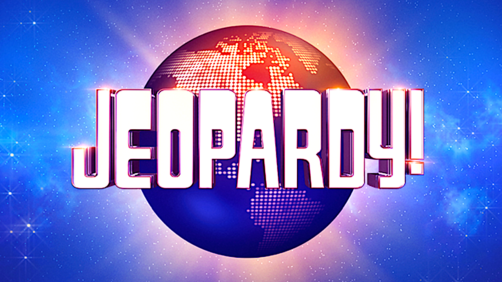

Jeopardy web app is a web-based implementation of the [Jeopardy!](https://en.wikipedia.org/wiki/Jeopardy!) game.
Free to play, open-source, no adds and multiplayer.
It is designed to be played with friends, family, or colleagues on a video call, in addition to the web app.

Thanks to [j-archive.com](https://j-archive.com/) for the episode questions and clues.

## How to Play

### Setup

- Host creates a new game in https://jeopardyweb.app/lobby
- Host selects an episode from j-archive.com
  + Episode ids are shown as a game_id query param in j-archive
  + Example: https://j-archive.com/showgame.php?game_id=1234
  + Host screens episode questions for appropriate content
  + Some episodes may be missing questions or require missing visual/audio/video clues
- Host joins the same game from another device or in another window
  + Host must login with the same username
  + If joining from another device or browser, they will be prompted to enter their session id, which can be found in localStorage
  + Host visits `/games/{game_id}/host` route to see correct responses to all clues
- Host creates a video call and invites contestants
- Host sends the game url to contestants
  + `/games/{game_id}/lobby`
- Host waits for all contestants to join video call and game lobby

### Game Play

- Host starts the game by advancing to the next game state (video intro)
  + Host can do this by pressing "n" key
  + `/games/{game_id}/video`
  + Once video finishes, game state automatically advances to the next state (jeopardy round)
- Host welcomes contestants and explains the rules
- Host reveals the money values on the board by pressing the "v" key (reVeal)
- Host reveals the categories one-by-one
  + press the "c" key will zoom in on the first category
  + click on each category to reveal it and read aloud
  + press the right arrow key to advance to the next category
  + after revealing last category, press the "shift + c" key to zoom out
- Host randomly selects a contestant to go first by pressing the "a" key (Activate)
- Note the white square in the contestants list to indicate the active contestant

### Clues

- The active contestant chooses a category and value for the next question and tells the host.
- Host reveals the clue by clicking on the tile.
- Host reads the clue aloud.
- While the clue is being read, all contestant buzzers are not yet enabled (orange).
- Once host finishes reading the clue, they will start the host timer by pressing spacebar.
- Once the host timer starts, all contestant buzzers are enabled (green).
- If contestants buzz in before buzzers are enabled, they will be penalized with a 500ms timeout. Their buzzer will turn red and be disabled for 500ms, after which it will become enabled again and turn green. This discourages button mashing.
- The first contestant to buzz in by clicking their buzzer button in the bottom right or pressing the space bar becomes the active contestant.
- Once clue has been read
  + if there is an active contestant
    * host prompts for an answer by speaking that contestants name 
    * host then starts the contestant timer by pressing spacebar
    * contestant has 5 seconds to respond
    * if the contestant responds correctly, host awards points by clicking the correct button (✓), and play continues with that contestant choosing the next category and value
    * if the contestant responds incorrectly or their timer runs out, host detracts points by clicking the incorrect button (x), the host timer is automatically started, and any contestant can buzz in to become the active contestant and respond.
    * if no contestant buzzes in after an incorrect response, and the host timer runs out, host speaks correct response orally to all and play continues with the previous active contestant choosing the next category and value (activated automatically by closing the clue)
  + if there is no active contestant
    * if no contestant buzzes in and host timer expires, host speaks correct response orally to all and play continues with the previous active contestant choosing the next category and value (activated automatically by closing the clue)

### Daily Double

- When a contestant chooses a clue that is a daily double
  + contestant must wager none, some or all of their current score
  + as soon as contestant submits their wager, clue is automatically revealed
  + host reads the clue aloud and starts the contestant timer
  + active contestant must respond within 5 seconds
  + if the contestant responds correctly, host awards the wagered points by clicking the correct button (✓)
  + if the contestant responds incorrectly or their timer runs out, host detracts the wagered points by clicking the incorrect button (x)
  + play continues with the active contestant choosing the next category and value

### Double Jeopardy

- Once all clues have been revealed in the jeopardy round, host advances to the double jeopardy round
- Game play is the same as first round, but all clues are worth double the money and there are two daily doubles

### Final Jeopardy

- When all clues have been revealed, host advances to the final jeopardy round
- Host reveals the final jeopardy category by clicking on the tile
- Host reveals the final jeopardy clue by clicking on the tile
- Host reads the clue aloud, and then starts the 30 second music clip
- Contestants must enter their response and wager in the input fields
- Contestants must wager none, some or all of their current score
- Once the 30 second music clip finishes, host cycles final jeopardy state back to logo
- Contestants that submitted a response and wager are shown with a green block next to their name
- Host starts with the lowest scoring contestant and reveals their response and wager by clicking on the green block
- If their response is correct, host awards the wagered points
- If their response is incorrect, host detracts the wagered points
- Host continues revealing responses and wagers for each contestant and awarding or detracting points
- Once all responses have been revealed and points awarded or detracted, game is finished

